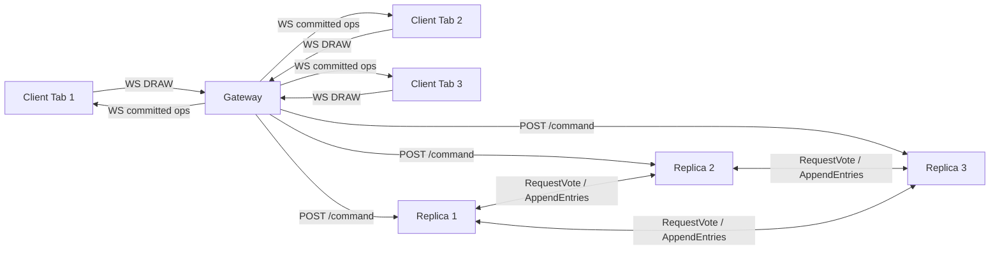

# MiniRAFT Collaborative Canvas Architecture

## 1. System Overview

This project simulates a distributed real-time collaboration stack with RAFT-lite consensus semantics.

Components:
- 1 Gateway service (WebSocket + HTTP)
- 3 Replica services (state machine replicas with leader election)
- 1 Frontend service (browser drawing canvas)

High-level flow:
1. Browser sends drawing segments to Gateway over WebSocket.
2. Gateway forwards commands to the current leader replica.
3. Leader appends command to log and replicates to followers via AppendEntries.
4. On majority success, leader commits and followers apply committed entries.
5. Gateway polls committed state from leader and broadcasts changes to all clients.

## 2. Cluster Diagram

## 3. RAFT-lite Protocol Design

State held by each replica:
- currentTerm
- role: follower, candidate, leader
- votedFor
- leaderId
- log[] entries: { index, term, command }
- commitIndex, lastApplied
- stateMachine.operations[]

Election behavior:
- Followers start randomized election timeout.
- Timeout triggers candidacy and term increment.
- Candidate requests votes from all peers.
- Majority grants => candidate becomes leader and starts heartbeat loop.

Replication behavior:
- Leader appends new client command to local log.
- Leader sends AppendEntries to peers with consistency checks.
- Followers reject on log mismatch; leader decrements nextIndex and retries.
- Leader commits only after majority replication in current term.
- Committed entries are applied to the state machine in order.

Consistency properties provided:
- Leader-based command ordering.
- Prefix consistency through prevLogIndex/prevLogTerm checks.
- Majority commit semantics.
- Deterministic replay to state machine.

## 4. State Transition View

Follower:
- Receives valid AppendEntries -> stay follower, reset election timer.
- Election timeout -> candidate.

Candidate:
- Majority votes -> leader.
- Receives higher term -> follower.
- Election timeout -> new election round.

Leader:
- Sends periodic heartbeats.
- Receives higher term response -> follower.
- Accepts and replicates client commands.

## 5. API Definitions

Replica API:
- GET /health
  - returns role, term, leaderId, commitIndex, logLength
- GET /state
  - returns committed operations and metadata
- POST /raft/request-vote
  - used for election votes
- POST /raft/append-entries
  - used for heartbeat and log replication
- POST /command
  - leader-only command append + majority replication
- POST /admin/graceful-reload
  - flips node into graceful shutdown path

Gateway API:
- GET /health
  - active leader view + connected clients
- GET /cluster
  - point-in-time health for all replicas
- WebSocket /
  - client->gateway: DRAW
  - gateway->client: CANVAS_SNAPSHOT, DRAW_COMMITTED, LEADER_UPDATE, ERROR

## 6. Failure Handling Design

Leader failure:
- Heartbeats stop.
- Followers timeout and start election.
- New leader is elected via majority votes.
- Gateway rediscovers leader and resumes command routing.

Follower failure:
- Quorum remains with 2/3 nodes.
- Leader continues accepting commands.
- Recovered node catches up from AppendEntries retries.

Gateway-level resilience:
- Continuous leader discovery.
- Retry path on command route failure.
- Snapshot-on-connect for late joiners.

## 7. Reliability and Zero-Downtime Features

Graceful reload:
- Replica handles SIGTERM/SIGINT by halting election/heartbeat loops.
- HTTP server closes gracefully before exit.

Blue-green style replacement:
- Scripted rebuild and isolated service replacement with no full-cluster stop.
- Quorum-based availability allows replacement of one replica while traffic continues.

Failover correctness:
- Leader demotion on higher term discovery.
- Majority-only commit ensures post-failover consistency.

Multi-client sync:
- Gateway fan-out broadcasts committed operations to all WebSocket clients.
- Snapshot sent on connect to converge client state.

Chaos testing:
- Script repeatedly kills/restores random replicas while checking cluster health.

## 8. Real-World Relevance Mapping

Kubernetes Control Plane:
- etcd leadership and consensus are mirrored by election + replication behavior.

Microservice architecture:
- Gateway and replicas communicate over service APIs and survive partial failures.

Production rollouts:
- One-instance-at-a-time replacement mimics rolling/blue-green safety goals.

Real-time collaboration systems:
- Client actions are event commands replicated and rebroadcast for convergence.

Cloud infrastructure roles:
- Demonstrates term-based leader control, quorum commits, and failure domains.
